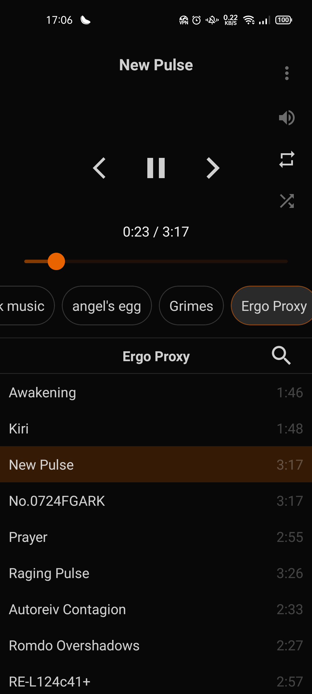
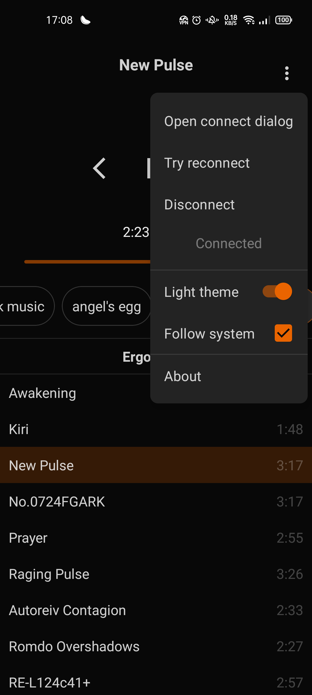

# Clementine Flow
Stylish and simple Clementine remote android app.

## Features
  - Functional and simple player remote
  - Designed so everything can be reached with ease with only one hand
  - Dark and light theme
  - Simple connect
  - Playlist song search
  - List of the current open playlists

## Some pics

Interface           |  Settings
:------------------:|:------------------:
  |  

## What it doesn't have (but the official does)
  - Song cover (images)
  - Downloader
  - Notification player controller
  - Library viewer (only can controll open tabs)

## Why use this and not the official clementine android app
Although the official clementine app is featured and functional
it lacks a direct interface from where you can control all the
usual operations one would want from a player such as the playlists list, songs
list, etc from one place. This app does that. Basically, is a more ergonomic alternative

## Tech
  - Made with jetpack compose and kotlin flows entirely

## License
GPL-3
